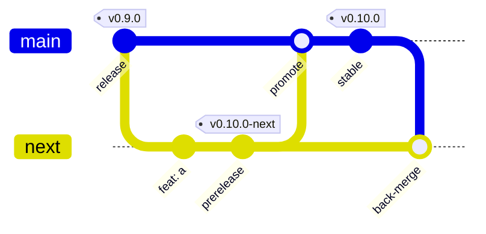

# Releasing

voidflow uses release channels mapped to branches, driven by
[release-please](https://github.com/googleapis/release-please) and Conventional
Commits ([`release-please.yml`](.github/workflows/release-please.yml)).

| Branch | Channel | Version | npm dist-tag | GitHub release |
|---|---|---|---|---|
| `main` | stable | `0.10.0` | `latest` | normal |
| `next` | prerelease | `0.10.0-next`, then `-next.1`, `-next.2` | `next` | prerelease |
| `release/N.x` | maintenance (patch-only) | `0.9.4` | `release-N.x` | normal |



## Ship a feature

1. Branch from `next`, open the PR against `next`, squash-merge it.
2. release-please keeps a prerelease PR open on `next`. Merging it tags
   `vX.Y.Z-next` (then `-next.1`, `-next.2`), creates a GitHub prerelease and publishes to npm under
   `next` (and to JSR).
3. To try it in a site, pin the prerelease tag's commit SHA, or install the
   package with `bun add @taraxvoid/voidflow@next`.

## Promote next to main

1. `just promote` opens the `next` to `main` PR.
2. Merge it with a **merge commit** (not squash) so each Conventional Commit
   reaches release-please. The `main` ruleset allows squash and merge only.
3. release-please opens or updates the stable release PR on `main`. Merging it
   publishes under `latest`, moves the floating `v0` tag, and opens a
   `main` to `next` back-merge PR.
4. Merge the back-merge PR with a merge commit too.

## Hotfix

Fix on a branch off `main`, PR to `main`, squash-merge, release as above. The
automatic back-merge brings it into `next`.

## Backport to an older line

1. `just cut-maintenance v0.9.3 release/0.9.x` creates the branch in a new
   worktree with the maintenance release-please config. Push it:
   `git -C <worktree> push -u origin release/0.9.x`.
2. Cherry-pick the fix onto a branch from `release/0.9.x`, PR to
   `release/0.9.x`, squash-merge.
3. Merge the release PR that release-please opens there. It publishes
   `0.9.4` under the `release-0.9.x` dist-tag and never touches `latest` or `v0`.

## Republish a tag

Run the Release Please workflow manually (`workflow_dispatch`) from the branch
that owns the tag's channel (`main`, `next` or `release/N.x`), give it the tag,
and tick `dry-run` first to check without publishing. A tag that does not fit
the branch's channel is rejected.

## If the back-merge fails

The job only auto-resolves `package.json`, `jsr.json`, `CHANGELOG.md` and the
main manifest. Any other conflict fails the job on purpose. Merge by hand:

```sh
git switch -c backmerge/fix origin/next
git merge origin/main     # resolve; keep main's version files
jq --arg v "<released version>" '.["."] = $v' .release-please/next-manifest.json > /tmp/m.json
mv /tmp/m.json .release-please/next-manifest.json
git commit -am "chore: back-merge main into next" && git push -u origin HEAD
```

then open the PR against `next` and merge it with a merge commit.

## Consuming

See [Versioning](README.md#versioning) for pinning options.
